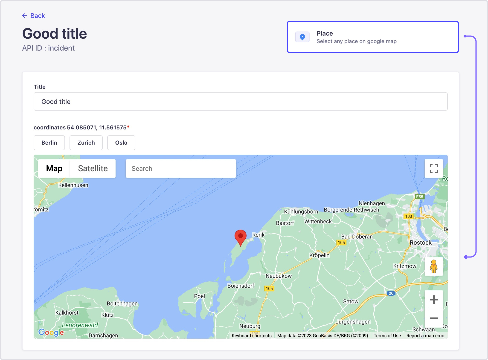
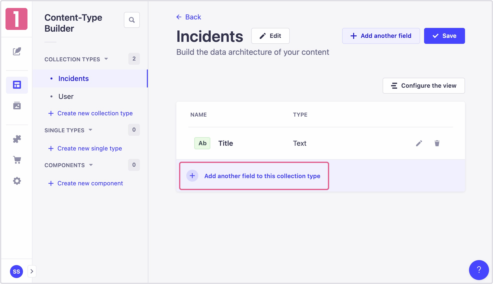

<div align="center">
  
</div>
<div align="center">
  <h1>Strapi v4 - google map geocoder</h1>
  <p>A simple plugin to geocode address
</a> package</p>
</div>

<!--  -->

---

## 🗿 How to install

```javascript
# yarn
yarn add strapi-plugin-google-geocoder

# npm
npm i strapi-plugin-google-geocoder
```

## 🔧 Configuration

#### 1. Add plugin in plugins.js
```javascript
// config/plugins.js
...
...
"google-geocoder": {
    config: {
      apiKey: env("STRAPI_ADMIN_GOOGLE_MAPS_API_KEY"), // required
    },
},
...
...
{::comment}
```
#### 2. Add "strapi::security" in middlewares.js
```javascript
// config/middlewares.ts
...
...
'strapi::errors',
{
  name: "strapi::security",
  config: {
  contentSecurityPolicy: {
    directives: {
      "script-src": ["'self'", "maps.googleapis.com", "maps.gstatic.com"],
      "img-src": ["'self'", "data:", "maps.googleapis.com", "maps.gstatic.com"],
    },
  },
  },
},
'strapi::cors',
...
...
```
{:/comment}

#### 2. Add custom field

<!--  -->


