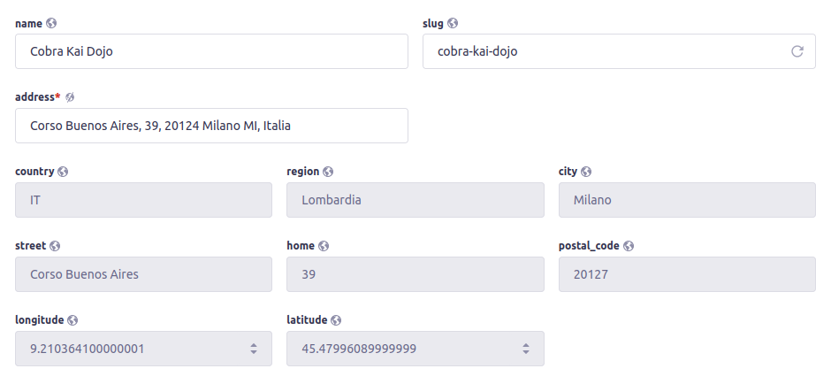
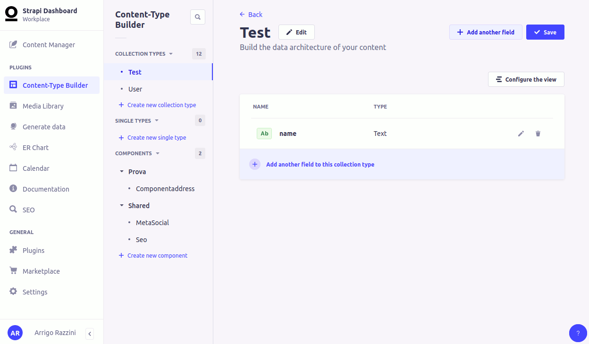

<div align="center">
  
</div>
<div align="center">
  <h1>Strapi v4 - google geocoder</h1>
  <p>A simple strapi plugin to geocode address</p>
</div>



---

## 🗿 How to install

```javascript
# yarn
yarn add strapi-plugin-google-geocoder

# npm
npm i strapi-plugin-google-geocoder
```

## 🔧 Configuration

#### 1. Add plugin in plugins.js
```javascript
// config/plugins.js
...
...
"google-geocoder": {
    config: {
      apiKey: env("STRAPI_ADMIN_GOOGLE_MAPS_API_KEY"), // required,
      types: ['geocode'], // optional, default is 'geocode' - more info on  https://developers.google.com/maps/documentation/javascript/place-autocomplete#constrain-place-types
      componentRestrictions: { // optional
        country: ["it"], // restrict search result to specified country only
      } 
    },
},
...
...
```
#### 2. Add custom field




